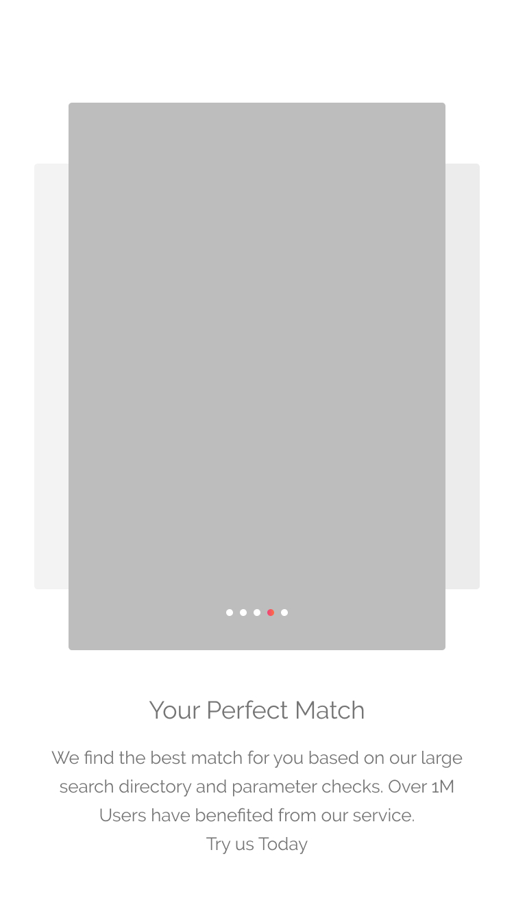

# Flutter UI 17 Rish Dating App UI

[](https://forthebadge.com)
[](https://forthebadge.com)
[](https://forthebadge.com)
[](https://forthebadge.com)
[](https://forthebadge.com)


## Introduction 📌

Everyone wants to have a soulmate in their life and you may or may not know that it tkaes time to fid your perfect soul mate.

I have tried building a dating app UI from the images of what i found online. The app is Called Rish, where users can find their perfect match.

__This project is mostly UI part with multiple login option.__

## Technology Stack 🏁

- [Flutter](https://flutter.dev/)
- [Firebase](https://pub.dev/packages/firebase_auth)
- [Google Sign In](https://pub.dev/packages/google_sign_in)
- [Facebook Sign In](https://pub.dev/packages/flutter_facebook_login)
- [Twitter Sign In](https://pub.dev/packages/flutter_twitter_login)

## Why this Project? 🏃‍♂️

My main goal behind creating this project was creating an interactive UI which could make users use this app. Apart from this i was making it to implement google, twitter & facebook sign in and many other new things which i saw in some flutter videos.

Although some of the screens did not have a perfect location for their placement, yet the project is looking cool.

For this project, i have worked on various domains like:
* UI/UX Development with Flutter
* Image Capturing with Camera
* Multiple sign in options
* Firebase integration

## 👀 Build Instructions 

- Clone the Repository: `git clone https://github.com/harshkumarkhatri/Flutter-UI-17-Dating-App-UI-1`
- `cd` into the Repository: `cd Flutter-UI-17-Dating-App-UI-1`
- If you want to have a look at the project in web then you can follow the steps given below.
  - Enable beta channel and enable web support:
```
$ flutter channel beta
$ flutter upgrade
$ flutter config --enable-web
```
- Check for the Devices configured for Flutter Web: `flutter devices`
- Run the App in Release Mode: `flutter run`
- Generate a Build: `flutter build apk --split-per-abi`

## Snaps from the UI
</p>




</p>


## Contributors ✨

- [Harsh Kumar Khatri](https://github.com/harshkumarkhatri)